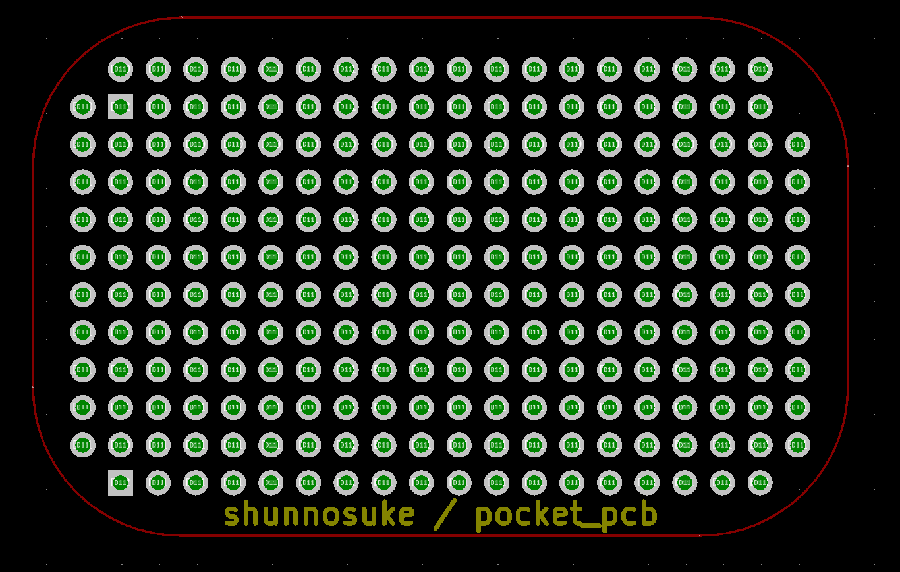

# PCB for PocketBeagle

Since I have created a PCB for use with PocketBeagle, I will publish KiCad data.
At present it is only universal board with almost no wiring.

Because I made several boards, I will divide it by 1000 yen.
I'm sorry, but I will charge a shipping fee.

PocketBeagleと一緒に使うためのPCBを作成したので，KiCadデータを公開します。
現時点では配線がほとんどないユニバーサル基板のみです。

何枚か基板を作ったので，必要な人には1枚1000円でお分けします。
すみませんが，送料は別途いただきます。

## License

 This work is licensed under a <a rel="license" href="http://creativecommons.org/licenses/by/4.0/">Creative Commons Attribution 4.0 International License</a>.

&#169; 2018 Shunnosuke Tokuhira
